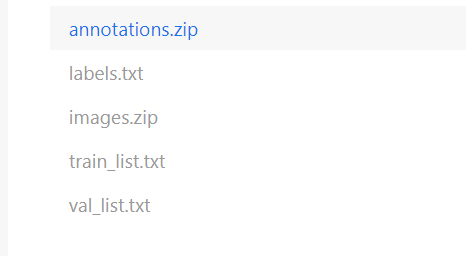
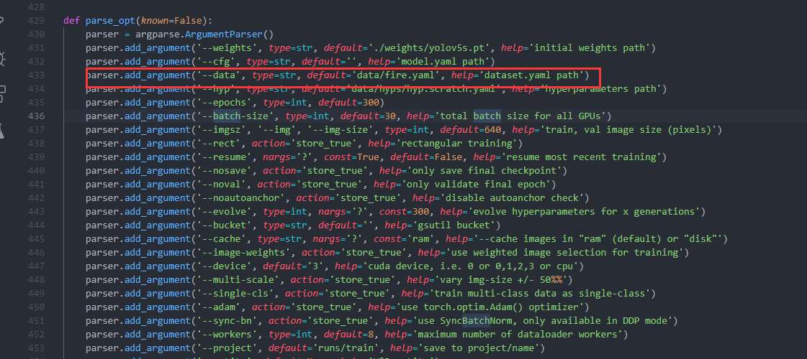

# yolov5-fire-smoke-detect-python
A python implementation of Yolov5 to detect fire or smoke in the wild in Jetson Xavier nx and Jetson nano

You can see video play in [BILIBILI](https://www.bilibili.com/video/BV1VT4y1975b), or [YOUTUBE](https://www.youtube.com/watch?v=5Ysqc5bWhBM).

If you have problem in this project, you can see this [artical](https://blog.csdn.net/weixin_42264234/article/details/121214079).

And If you want play it in jetson nano or jetson xavier , you can see this project [yolov5-fire-smoke-detect](https://github.com/RichardoMrMu/yolov5-fire-smoke-detect)


# Dataset
You can get the dataset from this [aistudio url](https://aistudio.baidu.com/aistudio/datasetdetail/107770). And the fire & smoke detect project pdpd version can be found in this [url](https://github.com/PaddlePaddle/awesome-DeepLearning/tree/master/Paddle_Enterprise_CaseBook). It is an amazing project.
## Data
This pro needs dataset like 
```
../datasets/coco128/images/im0.jpg  #image
../datasets/coco128/labels/im0.txt  #label
```


Download the dataset and unzip it. 



```shell
unzip annnotations.zip
unzip images.zip
```
You can get this.
```
 ├── dataset
	├── annotations
  │   ├── fire_000001.xml
  │   ├── fire_000002.xml
  │   ├── fire_000003.xml
  │   |   ...
  ├── images
  │   ├── fire_000001.jpg
  │   ├── fire_000003.jpg
  │   ├── fire_000003.jpg
  │   |   ...
  ├── label_list.txt
  ├── train.txt
  └── valid.txt
```
You should turn xml files to txt files. You also can see [this](https://github.com/ultralytics/yolov5/wiki/Train-Custom-Data
). 
Open `script/sw2yolo.py`, Change `save_path` to your own save path,`root` as your data path, and `list_file` as `val_list.txt` and `train_list.txt` path.

```Python
list_file = "./val_list.txt"
xmls_path,imgs_path = get_file_path(list_file)

# 将train_list中的xml 转成 txt， img放到img中
save_path = './data/yolodata/fire/cocolike/val/'
root = "./data/yolodata/fire/"
train_img_root = root 
```

Then you need `script/yolov5-split-label-img.py` to split img and txt file.


```shell
mkdir images
mkdir lables
mv ./train/images/* ./images/train
mv ./train/labels/* ./labels/train
mv ./val/iamges/* ./images/val
mv ./val/lables/* ./lables/val
```

Finally You can get this.
```
 ├── cocolike
	├── lables
  │   ├── val 
  │       ├── fire_000001.xml
  |       ├──   ...
  │   ├── train
  │       ├── fire_000002.xml
  |       ├──   ...
  │   
  ├── images
  │   ├── val 
  │       ├── fire_000001.jpg
  |       ├──   ...
  │   ├── train
  │       ├── fire_000003.jpg
  |       ├──   ...
  ├── label_list.txt
  ├── train.txt
  └── valid.txt
```
## Datafile
`{porject}/yolov5/data/` add your own yaml files like `fire.yaml`.
```yaml
# YOLOv5 🚀 by Ultralytics, GPL-3.0 license
# COCO128 dataset https://www.kaggle.com/ultralytics/coco128 (first 128 images from COCO train2017)
# Example usage: python train.py --data coco128.yaml
# parent
# ├── yolov5
# └── datasets
#     └── coco128  downloads here


# Train/val/test sets as 1) dir: path/to/imgs, 2) file: path/to/imgs.txt, or 3) list: [path/to/imgs1, path/to/imgs2, ..]
path: /home/data/tbw_data/face-dataset/yolodata/fire/cocolike/  # dataset root dir
train: images/train  # train images (relative to 'path') 128 images
val: images/val  # val images (relative to 'path') 128 images
test:  # test images (optional)

# Classes
nc: 2  # number of classes
names: ['fire','smoke']  # class names
```

# Train
Change `{project}/train.py`'s data path as your own data yaml path.

Change `batch-size ` as a suitable num. Change device if you have 2 or more gpu devices.
Then 

```shell
python train.py
```

# Test
Use `detect.py` to test.

```shell
python detect.py --source ./data//yolodata/fire/cocolike/images/val/ --weights ./runs/train/exp/weights/best.pt
```
You can see `{project}/runs/detect/` has png results.